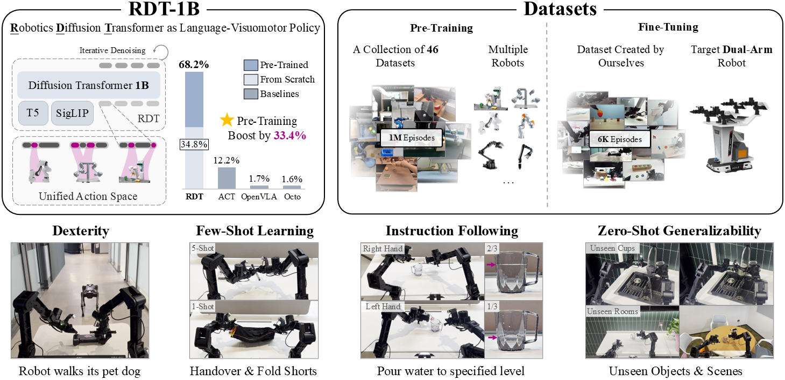

# RDT-1B: a Diffusion Foundation Model for Bimanual Manipulation

### 📝[Paper](https://arxiv.org/pdf/2410.07864) | 🌍[Project Page](https://rdt-robotics.github.io/rdt-robotics/) | 🤗[Model](https://huggingface.co/robotics-diffusion-transformer/rdt-1b) | 🛢️[Data](https://huggingface.co/datasets/robotics-diffusion-transformer/rdt-ft-data)



RDT-1B is a **1B**-parameter (*largest* to date) imitation learning **Diffusion Transformer** pre-trained on **1M+** (*largest* to date) multi-robot episodes. Given language instruction and RGB images of up to three views, RDT can predict the next $64$ robot actions. RDT is inherently compatible with **almost all kinds of modern mobile manipulators**, from single-arm to dual-arm, joint to EEF, position to velocity, and even with wheeled locomotion.

We have fine-tuned RDT on **6K+** (one of the *largest*) self-collected bimanual episodes and deployed it on the ALOHA **dual-arm** robot. It has achieved state-of-the-art performance in terms of dexterity, zero-shot generalizability, and few-shot learning. You can find Demo videos on our [project page](https://rdt-robotics.github.io/rdt-robotics/).

This repo is an official PyTorch implementation of RDT, containing:

- 🛠️Model [implementation](models/rdt_runner.py) of RDT
- 🤗1M-step [checkpoint](https://huggingface.co/robotics-diffusion-transformer/rdt-1b) of RDT-1B pre-trained on multi-robot data
- 🤗500K-step [checkpoint](https://huggingface.co/robotics-diffusion-transformer/rdt-170m) of RDT-170M (RDT(small) in [ablation](https://arxiv.org/pdf/2410.07864))
- 📈Training and sampling [scripts](train/train.py) (with DeepSpeed)
- 🤖An [example](scripts/agilex_inference.py) of real-robot deployment
- 🕹️Simulation benchmark from [Maniskill](https://github.com/haosulab/ManiSkill) environment

The following guides include the [installation](#installation), [fine-tuning](#fine-tuning-on-your-own-dataset), and [deployment](#deployment-on-real-robots). Please refer to [pre-training](docs/pretrain.md) for a detailed list of pre-training datasets and a pre-training guide.

## 📰 News
- [2024/12/17] 🔥 [Scripts](#simulation-benchmark) for evaluating RDT in Maniskill Simulation Benchmark is released!
- [2024/10/23] 🔥 **RDT-170M** (Smaller) model is released, a more VRAM-friendly solution 🚀💻.

## Installation

1. Clone this repo and install prerequisites:

    ```bash
    # Clone this repo
    git clone git@github.com:thu-ml/RoboticsDiffusionTransformer.git
    cd RoboticsDiffusionTransformer
    
    # Create a Conda environment
    conda create -n rdt python=3.10.0
    conda activate rdt
    
    # Install pytorch
    # Look up https://pytorch.org/get-started/previous-versions/ with your cuda version for a correct command
    pip install torch==2.1.0 torchvision==0.16.0  --index-url https://download.pytorch.org/whl/cu121
    
    # Install packaging
    pip install packaging==24.0
    
    # Install flash-attn
    pip install flash-attn --no-build-isolation
    
    # Install other prequisites
    pip install -r requirements.txt
    ```

2. Download off-the-shelf multi-modal encoders:

   You can download the encoders from the following links:

   - `t5-v1_1-xxl`: [link](https://huggingface.co/google/t5-v1_1-xxl/tree/main)🤗
   - `siglip`: [link](https://huggingface.co/google/siglip-so400m-patch14-384)🤗

   And link the encoders to the repo directory:

   ```bash
   # Under the root directory of this repo
   mkdir -p google
   
   # Link the downloaded encoders to this repo
   ln -s /path/to/t5-v1_1-xxl google/t5-v1_1-xxl
   ln -s /path/to/siglip-so400m-patch14-384 google/siglip-so400m-patch14-384
   ```
3. Fill the missing argument in [this file](configs/base.yaml#L22):
   
   Note that this buffer will only be used during pre-training. See [this doc](docs/pretrain.md) for more details.
   ```
   # ...
   
   dataset:
   # ...
   # ADD YOUR buf_path: the path to the buffer (at least 400GB)
      buf_path: /path/to/buffer
   # ...
   ```

## Fine-Tuning on Your Own Dataset

If your fine-tuning dataset is in the [Open X-Embodiment](https://robotics-transformer-x.github.io/) or the collection of our pre-training datasets (see [this doc](docs/pretrain.md#download-and-prepare-datasets)), you can also fine-tune RDT through the pre-trained pipeline. You need to remove other redundant datasets in the parameters. We refer to [this guide](docs/pretrain.md) (pre-training).

1. Prepare your dataset:

   You need to download your dataset to the disk and give it a name `my_cool_dataset`.

   Then, you can link your dataset to the repo directory:

   ```bash
   # Under the root directory of this repo
   cd data
   mkdir -p datasets
   
   # Link the downloaded dataset to this repo
   ln -s /path/to/my_cool_dataset datasets/my_cool_dataset
   ```

2. Implement the dataset loader:

   You need to:

   1. Register the configuration of `my_cool_dataset`:

      Append the control frequency of `my_cool_dataset` in [this file](configs/dataset_control_freq.json). Write the name of `my_cool_dataset` in [this file](configs/finetune_datasets.json) and [this file](configs/finetune_sample_weights.json), where the value of the sampling weight doesn't matter since you only have one dataset. In these two files, we leave a placeholder of `agilex`; you can simply replace it with `my_cool_dataset`.

   2. Re-Implement the class of `HDF5VLADataset`:

      You can find this class in [this file](data/hdf5_vla_dataset.py). In this file, we provide an example of loading the fine-tuning dataset used in our paper (see [this link](https://huggingface.co/datasets/robotics-diffusion-transformer/rdt-ft-data)).

      To adapt it to your dataset, you need to: (a) modify the `HDF5_DIR` (directory to `my_cool_dataset`) and `DATASET_NAME` (should be `"my_cool_dataset"`) in L21 and L22; (b) Implement the two functions of `parse_hdf5_file()` and `parse_hdf5_file_state_only()`. Please take a look at the original file for detailed comments and examples.

      Note 1: Despite its name, you don't necessarily need to use HDF5 to store your data. Just make sure that the class is correctly implemented.

      Note 2: During implementation, you may need to fill your robot action into the unified action vector (L180-194). Please refer to [this file](configs/state_vec.py) for an explanation of each element in the unified vector. We have reserved enough slots for each physical quantity. For example, we have reserved ten slots for joint angles. If your robot arm has six degrees of freedom, you only need to fill in the first six. 

      **IMPORTANT 1:** If your robot is single-arm, please fill its action into the *right-arm* portion of the unified action vector, aligning with our pre-training datasets.

      **IMPORTANT 2:** We use [6D representation](https://arxiv.org/pdf/1812.07035) for EEF rotation. If your action space contains EEF rotation (angle or quaternion), please refer to [this file](docs/test_6drot.py) for conversion. We note that this mapping is not reversible. Different Euler angles may be equivalent and correspond to the same 6D representation.

      **IMPORTANT 3:** No physical quantities (except the gripper width) are normalized during pre-training. This can preserve each physical quantity's meaning, thereby promoting generalization across robots. Therefore, we encourage you not to normalize any physical quantities but to choose appropriate units for them. Generally, we use the International System of Units, which ensures that most values fall within [-1,1]. As an exception, we perform min-max normalization on the gripper width to [0,1].

      **IMPORTANT 4:** If you use RTX 4090 (or lower), the GPU memory may be too low to load the `t5-v1_1-xxl` encoder. Instead, we recommend you precompute the language embeddings (see [this file](scripts/encode_lang_batch.py) for an example script) and load them during training. In this way, you need to specify the path to the embeddings in the `HDF5VLADataset` (see L148) rather than the natural language.

   3. Compute the dataset statistics information for `my_cool_dataset`:

      ```bash
      # Under the root directory of this repo
      # Use -h to see the full usage
      python -m data.compute_dataset_stat_hdf5
      ```

3. Start fine-tuning:

   Configurations relevant to model architecture and data processing are in [this file](configs/base.yaml). Normally, you do not need to modify these configurations; otherwise, it will cause errors in loading the pre-training checkpoint. Configurations relevant to training are passed through *Command Line Arguments*. Use `python main.py -h ` to see the descriptions. We provide an example of a fine-tuning script in [this file](finetune.sh) (`finetune.sh`). You may need to modify some of the parameters in this file, such as `CUTLASS_PATH` and `WANDB_PROJECT`.

   Use this to start fine-tuning:

   ```bash
   source finetune.sh
   ```

   with `finetune.sh` detailed as below:

   ```bash
      deepspeed --hostfile=hostfile.txt main.py \
         --deepspeed="./configs/zero2.json" \   # If you want to use DeepSpeed, which is strongly recommended
         --pretrained_model_name_or_path=<MODEL ID | DIRECTORY OF MODEL WEIGHTS | PATH TO MODEL CHECKPOINT> \
         --pretrained_text_encoder_name_or_path=<MODEL ID | PATH TO MODEL DIRECTORY > \   # e.g., google/t5-v1_1-xxl
         --pretrained_vision_encoder_name_or_path=<MODEL ID | PATH TO MODEL DIRECTORY> \  # e.g., google/siglip-so400m-patch14-384
         --output_dir=<DIRECTORY to SAVE CHECKPOINTS> \ # e.g., checkpoints/rdt-1b-agilex
         --train_batch_size=32 \
         --sample_batch_size=64 \   # batch size for diffusion sampling in validation 
         --max_train_steps=200000 \
         --checkpointing_period=1000 \
         --sample_period=500 \   # sample period for validation
         --checkpoints_total_limit=40 \
         --lr_scheduler="constant" \
         --learning_rate=1e-4 \
         --mixed_precision="bf16" \ # If you want to use mixed precision, bf16 is recommended
         --dataloader_num_workers=8 \
         --image_aug \  # If you want to use image augmentation
         --dataset_type="finetune" \
         --state_noise_snr=40 \  # If you want to add noise to the state
         --load_from_hdf5 \   # If you use HDF5 to store your data
         --report_to=wandb
   ```

   **IMPORTANT**: If you have already chosen to precompute the language embeddings, please specify `--precomp_lang_embed` in the `finetune.sh`.

   Note 1: `pretrained_model_name_or_path` can one of:

      - a string, the *model id* of a pre-trained model hosted inside a model repo on HuggingFace. Please fill with `"robotics-diffusion-transformer/rdt-1b"`, which is the officially-released [RDT-1B model](https://huggingface.co/robotics-diffusion-transformer/rdt-1b)🤗 at HuggingFace. (recommended)
      - a string, the path to a *directory* containing the manually downloaded model weights from HuggingFace, e.g., `"/path/to/rdt-1b"`. You should first manually download the `rdt-1b` directory from this [link](https://huggingface.co/robotics-diffusion-transformer/rdt-1b)🤗.
      - a string, the path to a *directory* containing model weights saved using [`~RDTRunner.save_pretrained`] method. This can be either:
        -  `"checkpoints/rdt-pretrain-1b/checkpoint-<STEP NUMBER>"`: This is the path to the checkpoint saved in the `<STEP NUMBE>` iteration during pre-training. Refer to [this file](docs/pretrain.md) for a tutorial on how to start your own pre-training.
        - `"checkpoints/rdt-pretrain-1b"`: If the pre-training completes normally without any exception, you can specify this path to load the last checkpoint.
      - a string, the path to model checkpoint (`*.pt`) saved by DeepSpeed, e.g., `"checkpoints/rdt-pretrain-1b/checkpoint-<STEP NUMBER>/pytorch_model/mp_rank_00_model_states.pt"` (verified)
      - `None` if you want to randomly initialize the model using configuration at `config_path`.

   Note 2: You can monitor the training process by observing `loss` (through a long window moving average) and `overall_avg_sample_mse` in [Wandb](https://wandb.ai/site) or [TensorBoard](https://www.tensorflow.org/tensorboard). We empirically found that the lower the `overall_avg_sample_mse`, the better the model performs. Usually, fine-tuning is over when this value converges.

   Note 3: If the training oscillates, you can increase the batch size by adding more GPUs or setting a larger `--gradient_accumulation_steps`.

## Deployment on Real-Robots

We have encapsulated the inference of the model into a class named `RoboticDiffusionTransformerModel` (see [this file](scripts/agilex_model.py#L38)). You can call this class's `step()` method for inference. However, you may need to re-implement some parts according to your specific robot. You should at least modify the `_format_joint_to_state()` (L164) and `_unformat_action_to_joint()` (L196) to convert between robot raw actions and unified action vectors that RDT accepts. You may also specify the control frequency of your robot (L49).

**IMPORTANT**: When you feed the images into `step()`, remember the order MUST be `[ext_{t-1}, right_wrist_{t-1}, left_wrist_{t-1}, ext_{t}, right_wrist_{t}, left_wrist_{t}]`.

We provide an example hardware code in [this file](scripts/agilex_inference.py) for deployment on Mobile ALOHA, and the corresponding running script in [this file](inference.sh) (`inference.sh`), which is detailed below;

   ```bash
      python -m scripts.agilex_inference \
         --use_actions_interpolation \
         --pretrained_model_name_or_path=<PATH TO MODEL CHECKPOINT> \  # your finetuned checkpoint: e.g., checkpoints/rdt-finetune-1b/checkpoint-<STEP NUMBER>, checkpoints/rdt-finetune-1b/checkpoint-<STEP NUMBER>/pytorch_model/mp_rank_00_model_states.pt, the same before
         --lang_embeddings_path=<PATH TO YOUR INSTURCTION EMBEDDINGS> \ # e.g. outs/lang_embeddings/your_instr.pt"
         --ctrl_freq=25    # your control frequency
   ```

**IMPORTANT**: If you on-board GPU memory is not enough to encode the language, please refer to [this file](scripts/encode_lang.py) for precomputation and specify the language embedding path in `inference.sh`. Detail instructions are provided below:

   1. Set Required Parameters in `scripts/encode_lang.py`

      ```python
      # ...

      GPU = 0
      MODEL_PATH = "google/t5-v1_1-xxl"
      CONFIG_PATH = "configs/base.yaml"
      SAVE_DIR = "outs/"   # output directory

      # Modify this to your task name and instruction
      TASK_NAME = "handover_pan"
      INSTRUCTION = "Pick up the black marker on the right and put it into the packaging box on the left."

      # Note: if your GPU VRAM is less than 24GB, 
      # it is recommended to enable offloading by specifying an offload directory. 
      OFFLOAD_DIR = None  # Specify your offload directory here, ensuring the directory exists.

      # ...
      ```

   2. Run the script
      ```
      python -m scripts.encode_lang
      ```

Note: If you want to deploy on the Mobile ALOHA robot, don't forget to install the hardware prerequisites (see [this repo](https://github.com/MarkFzp/mobile-aloha)).

## Simulation Benchmark

We comprehensively evaluate RDT against baseline methods using the ManiSkill simulation benchmark. Specifically, we focus on five benchmark tasks: `PegInsertionSide`, `PickCube`, `StackCube`, `PlugCharger`, and `PushCube`. Here's a brief overview of the evaluation setup:

**Evaluation Setup:**

1. **Install ManiSkill:**  
   Within the [RDT environment](#installation), install ManiSkill as follows:
   ```bash
   conda activate rdt
   pip install --upgrade mani_skill
   ```

2. **Configure Vulkan:**  
   Follow the [ManiSkill documentation](https://maniskill.readthedocs.io/en/latest/user_guide/getting_started/installation.html#vulkan) to properly set up Vulkan。

3. **Obtain Model Weights:**  
   Download the fine-tuned model weights from [this Hugging Face repository](https://huggingface.co/robotics-diffusion-transformer/maniskill-model/tree/main/rdt). Download the precomputed language embeddings from [here](https://huggingface.co/robotics-diffusion-transformer/maniskill-model/tree/main/lang_embeds) to the root directory of this repo.
   
4. **Run Evaluation Scripts:**  
   After completing the setup steps, execute the provided evaluation scripts to assess RDT on the selected tasks.

```
conda activate rdt 
python -m eval_sim.eval_rdt_maniskill \
--pretrained_path PATH_TO_PRETRAINED_MODEL
```

### Implementation Details

#### Data

Utilizing the [official ManiSkill repository](https://github.com/haosulab/ManiSkill), we generated 5,000 trajectories through motion planning. The initial action mode of these trajectories is absolute joint position control and we subsequently converted them into delta end-effector pose control to align with the pre-training action space of OpenVLA and Octo. We strictly adhered to the official codebases of OpenVLA and Octo, modifying only the dataset-loading scripts. Consequently, we finetuned OpenVLA and Octo using the delta end-effector pose data. For RDT and Diffusion-Policy we leverage joint position control data for training which is aligned with our pre-training stage as well.

####  Training
- OpenVLA is fine-tuned from the officially released pre-trained checkpoint with LoRA-rank 32 until converge.
- Octo is fine-tuned from the officially released pre-trained checkpoint for 1M iterations until converge. 
- Diffusion-Policy is trained from scratch for 1000 epochs. We select the checkpoint of 700 epoch which has the lowest validation sample loss of 1e-3.
- RDT is fine-tuned from our released pre-trained checkpoint for 300ks iterations.

#### Results

Each method is evaluated over 250 trials (10 random seeds with 25 trials per seed). The quantitative results, including success rate mean and std value across 10 random seeds are presented below:


||PegInsertionSide|PickCube|StackCube|PlugCharger|PushCube|Mean|
|---|---|---|---|---|---|---|
|RDT|**13.2±0.29%**|**77.2±0.48%**|74.0±0.30%|**1.2±0.07%**|**100±0.00%**|**53.6±0.52%**|
|OpenVLA|0.0±0.00%|8±0.00%|8±0.00%|0.0±0.00%|8±0.00%|4.8±0.00%|
|Octo|0.0±0.00%|0.0±0.00%|0.0±0.00%|0.0±0.00%|0.0±0.00%|0.0±0.00%|
|Diffusion-Policy|0.0±0.00%|40.0±0.00%|**80.0±0.00%**|0.0%±0.00%|88.0±0.00%|30.2±0.00%|

#### Finetune RDT with Maniskill Data

To fine-tune RDT with Maniskill data, first download the Maniskill data from [here](https://huggingface.co/robotics-diffusion-transformer/maniskill-model) and extract it to `data/datasets/rdt-ft-data`. Then copy the code in `data/hdf5_vla_dataset.py` to `data/hdf5_maniskill_dataset.py` and run the following script:

```
bash finetune_maniskill.sh
```

#### Reproducing Baseline Results

Download and extract the fine-tuned model weights from [here](https://huggingface.co/robotics-diffusion-transformer/maniskill-model) to `eval_sim/`.

- OpenVLA: Clone [OpenVLA repo](https://github.com/openvla/openvla) in `./eval_sim/` and install its environment & ManiSkill. Then run the following script:
```
python -m eval_sim.eval_openvla --pretrained_path PATH_TO_PRETRAINED_MODEL
```
- Octo: Clone [Octo repo](https://github.com/octo-models/octo.git) in `./eval_sim/` and install its environment & ManiSkill. The run the following script:
```
python -m eval_sim.eval_octo --pretrained_path PATH_TO_PRETRAINED_MODEL
```
- Diffusion-Policy: Clone our simplified [Diffusion-Policy repo](https://github.com/LBG21/RDT-Eval-Diffusion-Policy) in `./eval_sim/` and run:
```
python -m eval_sim.eval_dp --pretrained_path PATH_TO_PRETRAINED_MODEL
```

## FAQ

### 1. How can I fine-tune RDTs with limited VRAM?

- **Use a Smaller Model**: Opt for the [RDT-170M model](https://huggingface.co/robotics-diffusion-transformer/rdt-170m), which requires less VRAM.
  
- **Select a Memory-Efficient ZeRO Stage**: Choose a more memory-efficient ZeRO stage based on your needs:
  - **ZeRO-3 with Offload** > **ZeRO-3** > **ZeRO-2 with Offload** > **ZeRO-2** > **ZeRO-1**
  - By default, we use [ZeRO-2](https://github.com/thu-ml/RoboticsDiffusionTransformer/blob/c68398ed526733faca4eec52cc1a7d15a9f8fea7/finetune.sh#L29) for a balance between speed and memory efficiency. Find more details on ZeRO stages [here](https://huggingface.co/docs/transformers/main/deepspeed#select-a-zero-stage) and [here](https://www.deepspeed.ai/docs/config-json/#zero-optimizations-for-fp16-training).

- **Enable 8-bit Adam Optimization**: Activate 8-bit Adam by setting [`use_8bit_adam=True`](https://github.com/thu-ml/RoboticsDiffusionTransformer/blob/c68398ed526733faca4eec52cc1a7d15a9f8fea7/main.py#L195) for reduced memory usage during training.

- **Apply 4-bit or 8-bit Quantization**: Quantizing model weights can significantly reduce VRAM requirements.

- **Use [XFormers](https://github.com/facebookresearch/xformers)**: This library provides optimized transformers with efficient memory usage.

- **Enable Gradient Checkpointing**: Implement `gradient_checkpointing` manually to save memory during backpropagation. See [here](https://deepspeed.readthedocs.io/en/latest/activation-checkpointing.html) for instructions. Once you have successfully implemented this feature, we welcome you to submit a PR👏.
- **Gradient Accumulation**: Set a larger `--gradient_accumulation_steps=<num_steps>`. This will accumulate the gradients of `<num_steps>` batches for backpropagation. Equivalently, this will increase the batch size by `<num_steps>` times, at the cost of `<num_steps>` times the running time.

### 2. How many steps are recommended for fine-tuning RDT?

Regardless of the batch size you select, it is recommended to train for at least 150K steps to achieve optimal results.

### 3. What to do if t5-xxL is too large to store in GPU memory?

1. Do not load T5-XXL in your GPU memory when training. Pre-compute language embeddings in advance.
2. Set `OFFLOAD_DIR` to enable CPU offloading in `scripts/encode_lang_batch.py` and `scripts/encode_lang.py`.
3. Use smaller versions of t5 like t5-base instead of t5-xxL.

## Citation

If you find our work helpful, please cite us:

```bibtex
@article{liu2024rdt,
  title={RDT-1B: a Diffusion Foundation Model for Bimanual Manipulation},
  author={Liu, Songming and Wu, Lingxuan and Li, Bangguo and Tan, Hengkai and Chen, Huayu and Wang, Zhengyi and Xu, Ke and Su, Hang and Zhu, Jun},
  journal={arXiv preprint arXiv:2410.07864},
  year={2024}
}
```

Thank you!

## License

All the code, model weights, and data are licensed under [MIT license](./LICENSE).
